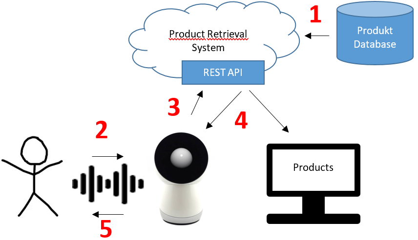

# MrJibo
In the context of a Project for the [ZHAW (Zurich University of Applied Sciences)](https://www.zhaw.ch/de/engineering/). the boundary and prospects of Social Robots in selling were investigated. A selling process is simulated using an existing social robot named [Jibo](https://developers.jibo.com/).

The project is a proof of concept based on [Jibo](https://developers.jibo.com/) for a social Sales Robot. This code give Jibo the ability to serve as a sales assistant in a shop or directly from your home. It can understand what you want, help to find it and place an order for you.

It is only a proof of concept. It still has too many limits and problems to be used on a real case.

## Demo

## Structure

### MrJibo
The behaviour of Jibo

### Product Retrieval System
This is a web service used for search the products. It provides an API, used from Jibo, that returns suggestions of product based on a query.

The Web Service runs on [Play Framework](https://www.playframework.com/) and needs [MongoDB](https://www.mongodb.com/) as database.

### Database Data
Those are some dummy data for the database in order to test the entire Project.

